# 📦 AI-Based Sorting Conveyor for Color, Weight, and Package Inspection

 
 

## 📝 Project Overview
This project is an automated sorting conveyor system developed for the **Embedded System Developer Module** course. The system integrates sensor technology and Artificial Intelligence to classify objects based on their **color**, **weight**, and **physical condition**.

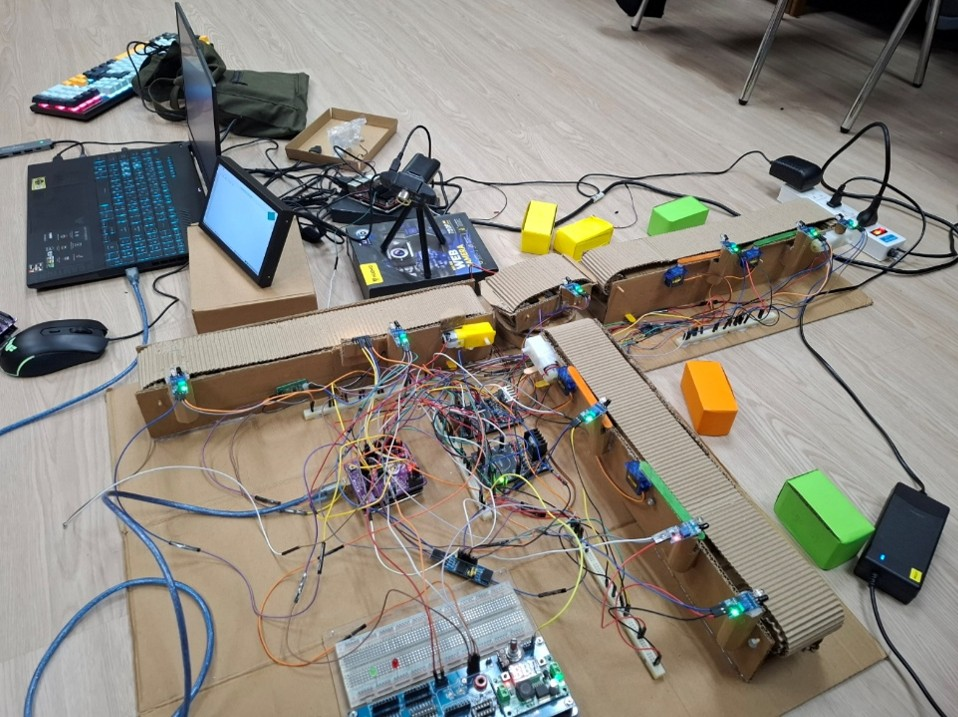
---

## 🚀 Key Features
* **AI-Driven Quality Control:** Uses a TensorFlow Lite model on an ODROID-C4 to detect if a box is damaged.
* **Sensor Fusion:** Combines data from IR sensors, color sensors (TCS34725), and load cells (HX711) for precise sorting.
* **Modular Architecture:** Software is divided into specific headers for easy maintenance (e.g., `motor_control.h`, `servo_control.h`).
* **Power Efficient:** Implements a power-down sleep mode that activates after 20 seconds of inactivity.

---

## 🏗️ Hardware Architecture
The system relies on a hybrid architecture between an **Arduino UNO R3** (low-level control) and an **ODROID-C4** (AI inference).

| Component | Role |
| :--- | :--- |
| **Arduino UNO R3** | Motor, Servo, and Sensor control  |
| **ODROID-C4** | AI Model execution (Teachable Machine)  |
| **TCS34725** | Color classification |
| **HX711 + Loadcell** | Weight verification |
| **Servo SG90** | Sorting gate |

---

## ⚙️ Logic Flow
1.  **Detection:** IR1 triggers the system.
2.  **Analysis:** The system checks color, weight, and uses AI to identify if the box is "damaged" or "good".
3.  **Action:**
    * **Bad Box:** Diverted to a waste bin (180° rotation).
    * **Good Box:** Sorted into light or heavy lanes based on weight, then moved to the respective color-coded bin.
4.  **Idle State:** System enters low-power mode to save energy.

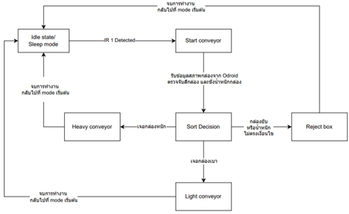
---

### 📋 Operational Scenarios
The system handles various box conditions through automated sorting logic. The following table illustrates the sorting actions for different object attributes:

| Category | Attributes | Action | Example 1 | Example 2 |
| :--- | :--- | :--- | :--- | :--- |
| **Heavy Lane** | Heavy / Yellow / Good | Sort to Heavy | 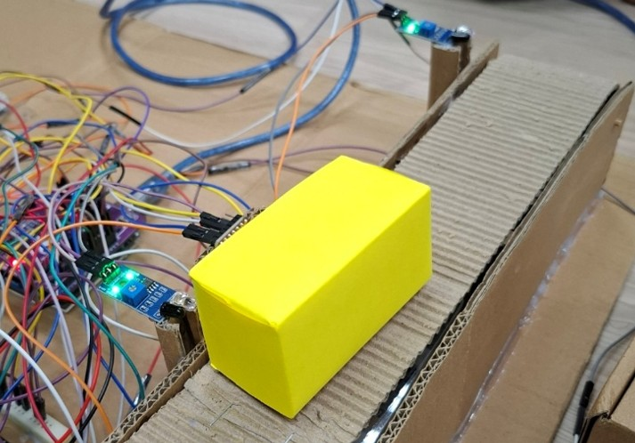 | 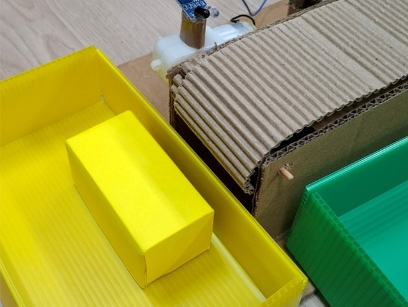 |
| **Heavy Lane** | Heavy / Green / Good | Sort to Heavy | 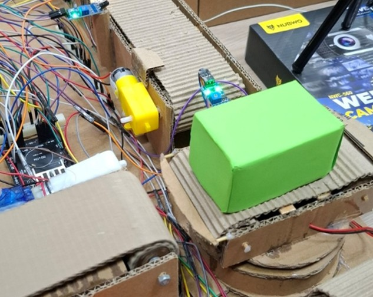 | 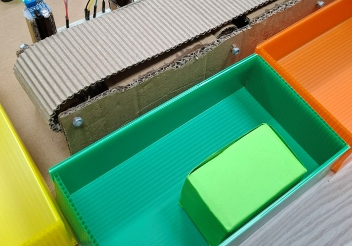 |
| **Heavy Lane** | Heavy / Orange / Good | Sort to Heavy | 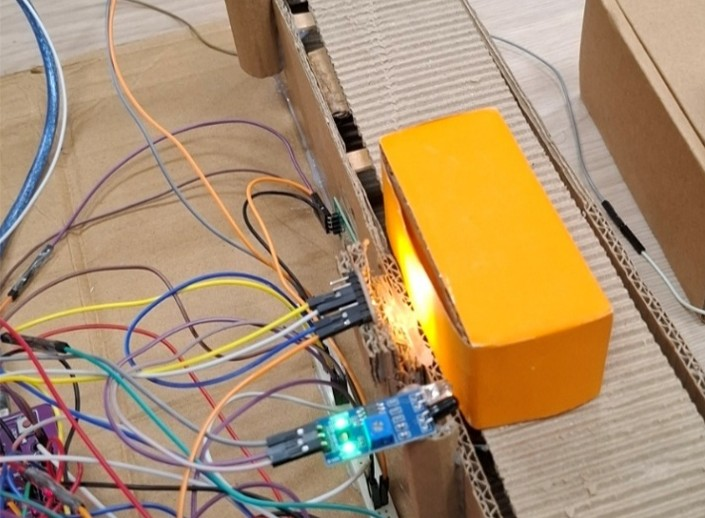 | 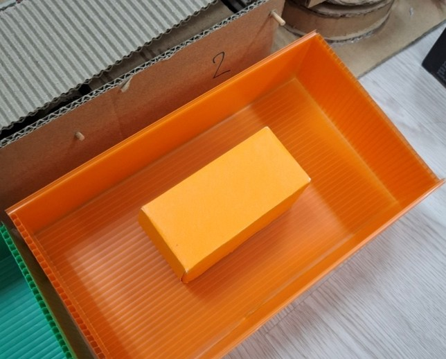 |
| **Light Lane** | Light / Yellow / Good | Sort to Light | 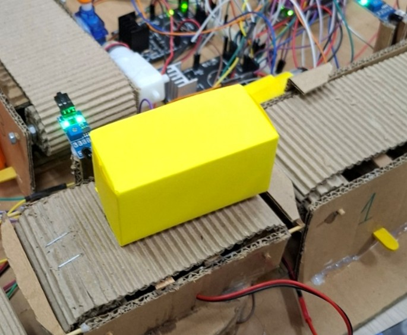 | 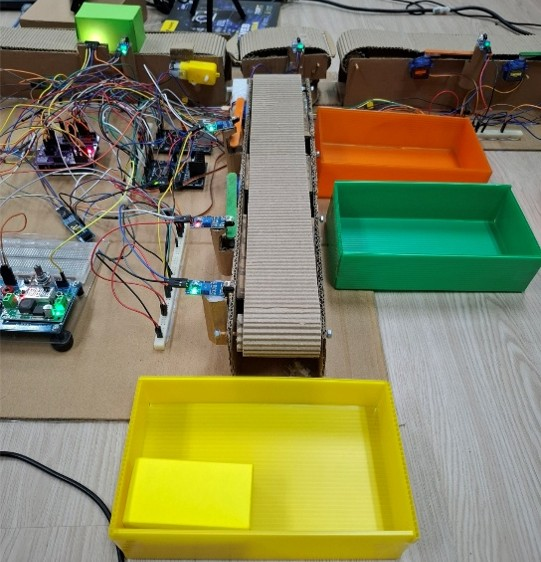 |
| **Light Lane** | Light / Green / Good | Sort to Light | 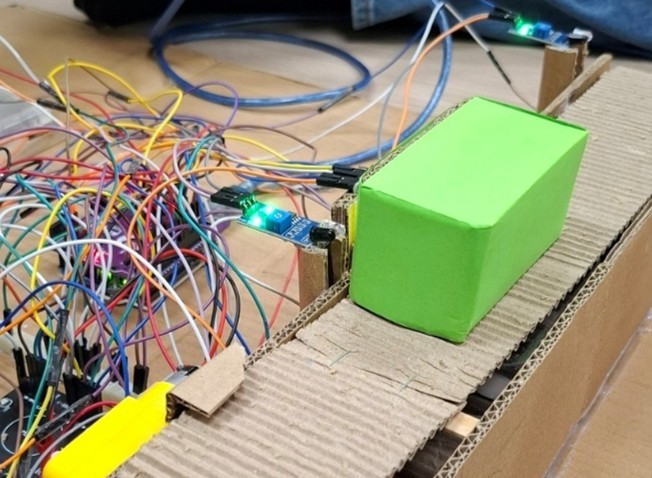 | 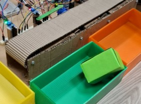 |
| **Light Lane** | Light / Orange / Good | Sort to Light | 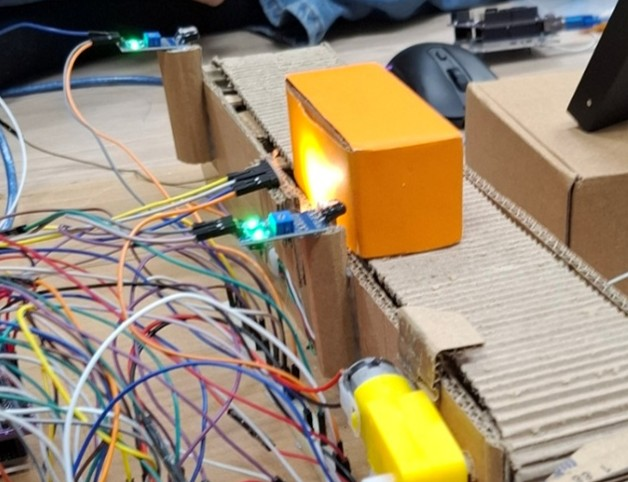 | 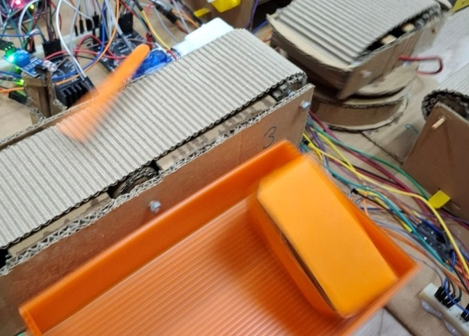 |
| **Waste Bin** | Light / Yellow / Damaged | Divert to Waste | 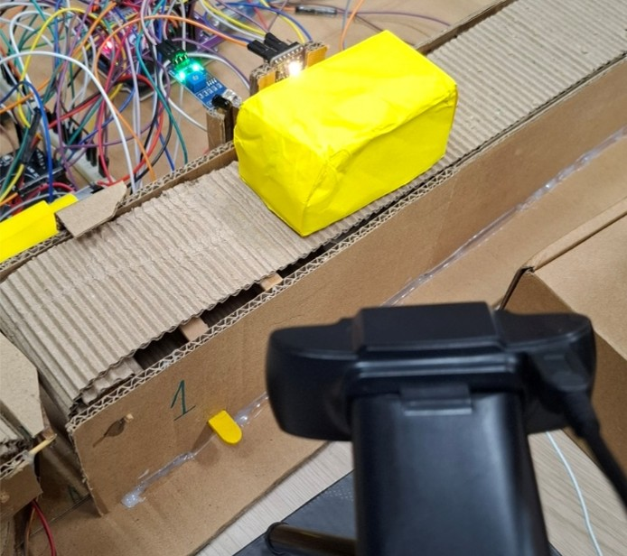 | 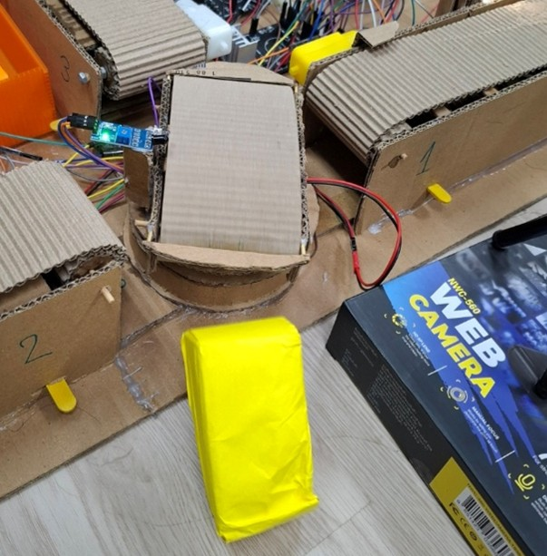 |
| **Waste Bin** | Lighter than standard / Orange / Good | Divert to Waste | 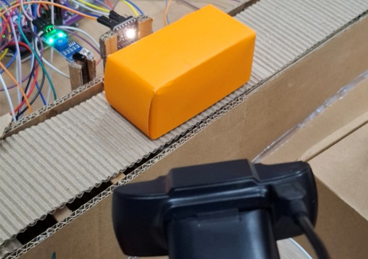 | 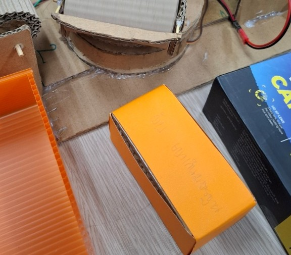 |

## 🛠️ Troubleshooting
During development, we encountered the following challenges:

* **Power Supply Stability:** High current consumption from motors and servos may cause resets. Use an external power supply with sufficient amperage.
* **Lighting Conditions:** * The camera requires consistent lighting without shifting shadows. 
    * The color sensor (TCS34725) is sensitive to ambient light; a "dark box" enclosure is recommended to prevent interference.
* **Camera Background:** Maintain a clean, neutral background to ensure high AI inference accuracy.

---

## 🚀 Future Improvements
* **Wireless Data Integration:** Implement Wi-Fi/Bluetooth to send real-time statistics to a mobile dashboard.
* **Unified AI Processing:** Transition to an advanced camera-based AI model capable of detecting both physical damage and color simultaneously, eliminating the need for external color sensors.
* **Centralized Power Distribution:** Design a custom PCB/PDU to manage high-current paths, minimizing voltage drops and simplifying wiring.